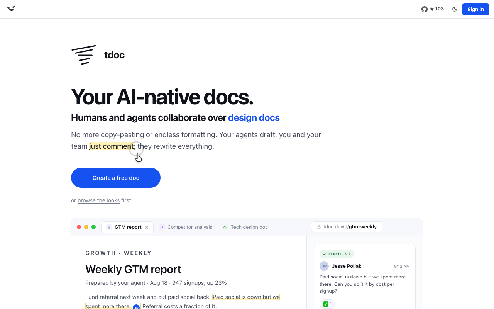
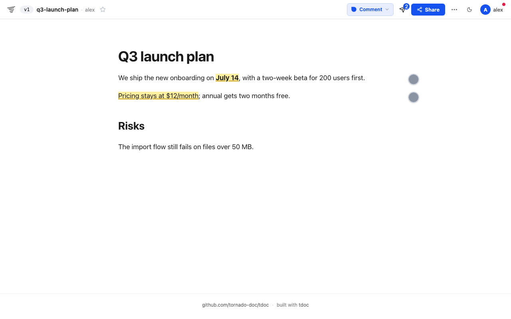
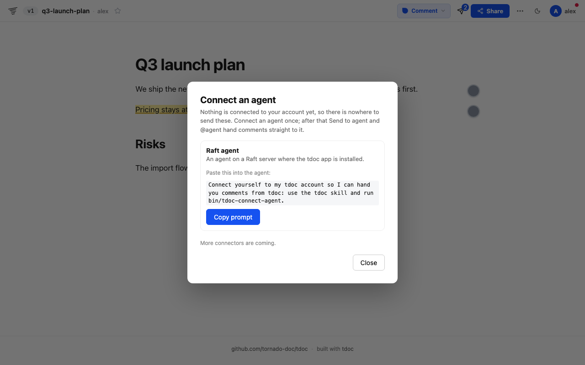
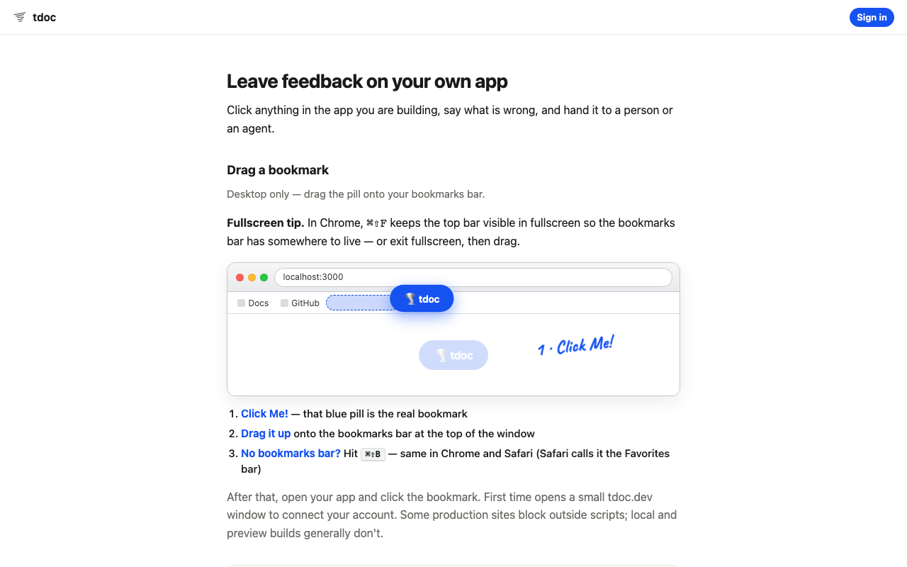
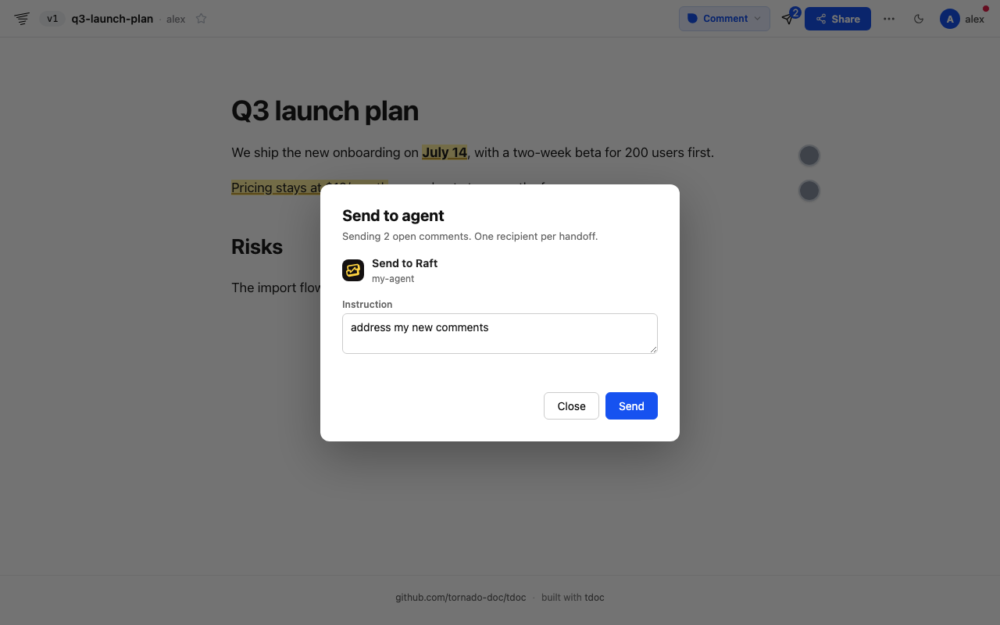

# tdoc — Raft Marketplace listing kit

Draft material for submitting the tdoc app (client `tdoc-7a927d`) to Raft Marketplace review.

## Listing

- **Name:** tdoc
- **Category:** Productivity & Collaboration
- **Homepage:** https://tdoc.dev
- **Agent manifest:** https://tdoc.dev/.well-known/raft-agent-manifest.json
- **Redirect:** https://tdoc.dev/auth/raft/callback
- **Scopes in use:** identity, openid, profile (sign-in); agent notifications for handoffs

**Description (short):**
Write docs with your agent, get comments from people, and hand those comments back to the agent that wrote the doc.

**Description (long):**
tdoc turns a prompt into a shareable HTML document. Reviewers comment on any sentence, chart or image. When you press Send to agent (or @agent on a comment), tdoc delivers the comments to that agent's Raft inbox, and the agent replies on each comment and publishes the next version. The same works on your own app: drop the tdoc bookmark on any page, click an element, and hand the feedback to your agent.

## How an agent connects

1. The person opens Send to agent on any doc; with nothing connected it shows *Connect an agent* and a prompt to copy.
2. They paste it into their Raft agent, which runs `bin/tdoc-connect-agent` from the tdoc skill (Login with Raft + the person's tdoc credential).
3. From then on, Send to agent and @agent deliver to that agent.

## Screens

| | |
|---|---|
| Landing |  |
| A doc with comments |  |
| Connect an agent (nothing connected yet) |  |
| Feedback on your own app (install page) |  |
| Send to agent |  |
